# Willow Flowers 

--> image of website on different devices 

[Willow Flowers](https://willow-flowers.herokuapp.com/) is a user-friendly e-commerce website built via main technologies [HTML](https://html.com/), [CSS](https://en.wikipedia.org/wiki/CSS), [JavaScript](https://www.javascript.com/about), [Python](https://www.python.org/) and [Django](https://www.djangoproject.com/). 
The purpose of this website is to enable consumers to purchase items, such as plants and flowers, and create a user profile to store their previous orders and site favourites to access at any time. The website owner can upload, edit and delete products when necessary. 

# Contents
* [UX Design](#UX-Design)
    * [Strategy](#strategy)
    * [Scope](#Scope)
    * [Structure](#Structure)
    * [Skeleton](##Skeleton)
    * [Surface](#Surface)
    * [Wireframes](#Wireframes)
* [Project Review](#Project-Review)
* [Databse](#Database)
* [Trello](#Trello)
* [Code Structure](#Code-Structure)
* [Features](#Features)
    * [Existing Features](#Existing-features)
    * [Features Left to Implement](#Features-Left-to-Implement)
* [Technologies Used](#Technologies-Used)
    * [Other Tools](#Other-Tools)
* [Testing](#Tesing)
    * [Code Validation](#Code-Validation) 
    * [Browser Capability](#Browser-Capability)
    * [Responsive Testing](#Responsive-Testing)
    * [User Stories](#User-Stories)
    * [Feature Testing](#Feature-Testing)
    * [Problems Encountered](#Problems-Encountered)
* [Deployment](#Deployment)
* [Credits](#Credits)
    * [Content](#Content)
    * [Media](#Media)
    * [Acknowledgements](#Acknowledgements)

# UX Design 

## Strategy
Following the five planes of user experience design, the strategy has been separated into *Who*, *What*, *Where*, *When* and *Why* to initially  understand the website users’ requirements and needs. 

**Who** - The customer will be an individual looking to purchase flowers or a plant for an occasion such as a Birthday, New Baby, Congratulations, Wedding, Get Well Soon and inside or out outside plants. The website will therefore not have a specific target demographic. 

**What** - The idea for this website is to design and build an e-commerce florist site whereby consumers can purchase and have products from the site delivered to recipients depending on the occasion at hand. They are also able to favourite specific items and keep them in their personal account favourites to revisit later. 

**Where** - The site will promote all products available, along with links to social media platforms to showcase to a wider audience. The site will also include a contact page, whereby consumers can contact the owners with any queries they have. 

**When** - The website will be available for users to make a purchase at any point in their journey. 

**Why** - Consumers will want to use this website to purchase florist products due to its easy navigation and information architecture layout, and simple payment process.

Following this, I also conducted some user stories to ensure the website will serve its purpose.

| As a:       | I would like to:                                | So that I can:                                            |
| :---        | :----                                           |  :---                                                     |
| **User**    | Shop the florist range by occasion              | Purchase some flowers for a particular event              |
| **User**    | Create a user account                           | Keep track of my previous purchases                       |
| **User**    | Search for a particular flower                  | Order them for a specific occasion                        |
| **User**    | Add multiple products to my basket              | Order more than one item at once                          |
| **User**    | Add and delete items from my basket             | Decide on my final purchase at the end of my experience   |
| **User**    | Receive an email confirmation of my order       | Have a copy of my order number                            |
| **User**    | Favourite an item advertised on the site        | Come back to it and purchase later                        |
| **User**    | Contact the owners of the business              | To thank them for my purchase                             |

 

| As a:       | I would like to:                                | So that I can:                                |
| :---        | :----                                           |  :---                                         |
| **Admin**   | View a list of orders that have come through    | Process the orders                            |
| **Admin**   | Add, Update, and delete products                | Update the website when necessary             |
| **Admin**   | Receive a copy of any contact forms submitted   | So, I can respond accordingly to the customer |

## Scope
The features included in this website will consist of:
* The option to narrow down a product search through filtering the occasion. 
* A search page to pull up results based on name and description (through a term such as a colour).
* Personal login to view previous orders.
* An option to create a personal account- to complete a purchase or save items to your favourites.
* Shopping basket to display reserved items and a subtotal amount (£).
* Testimonials from previous customers.
* Online payments and order confirmation.

## Structure 
Information architecture will be organised via product information. [Bootstrap cards](https://getbootstrap.com/docs/4.0/components/card/) will be used to organise the product preview images on pages such as the search, the product pages and the basket to keep the layout clean and simple. Buttons will guide the user to complete their purchase, sign up, login or navigate to another page on the site. 

## Skeleton
The navigation menu will be divided like so:

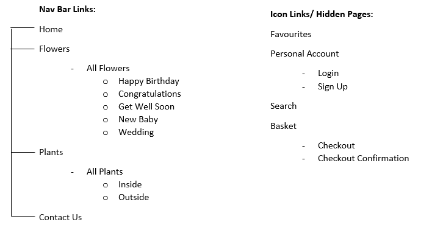

## Surface
Due to the fact there will be a lot of bursts of colour through the imagery of the products, I thought it would be best to keep surrounding colours minimal as to not over-crowd the page and avoid distraction for users. I will use an accent colour of Bubble-gum Pink (#ffc1cc) for the navigation menu, footer and buttons to keep the theme consitent. The font used will be [Playfair Display](https://fonts.google.com/specimen/Playfair+Display?query=playfair), taken from [Google Fonts](https://fonts.google.com/).

## Wireframes 
Below is a preview of the Home Page wireframes for desktop, tablet and mobile created on [Balsamiq](https://balsamiq.com/). The individual desktop, tablet and mobile wireframes with all pages can be found [here](documents/wireframes).

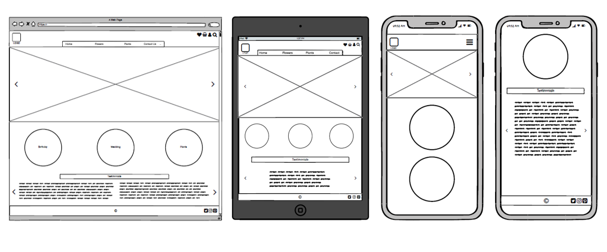

[Contents](#Contents)

# Project Review 

I constantly reflected through my wireframes during the development process for this project. Upon project completion, there are a few features which I refrained from implementing or changed during the development. 

**Toast Notifications**  – After much consideration, I had decided to not include toast messages into the final project. This was because I felt they weren’t completely necessary for the project at this stage. This is potentially something I will look to include further along the line of developing this project. 

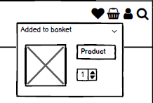

**The Basket Icon** – When it came to adding items to a user’s basket, initially I had designed for this to be done via clicking on a basket icon displayed in the product’s full description. I found out through my development that this was not actually the most feasible way to add an item to a user’s basket due to the quantity factor.

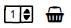

**Testimonial Carousel** - Initially I had designed this to show two rotating customer testimonials at a time on the Home page. This initially caused issues as the testimonials would only show inside the left column, leaving the right blank. Due to this, after careful consideration, I had decided to only preview one testimonial at a time on the home page, spanning the full width of the page.

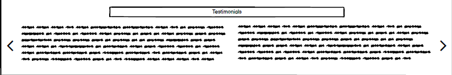

# Database
The database used for the development of the project was [SQLite](https://sqlite.org/index.html) which was later moved to [Heroku](https://dashboard.heroku.com/) using the [Postgres](https://www.postgresql.org/docs/) add-on. Below is a visualisation of the database schema.

** Database Schema Image

[Contents](#Contents)

# Trello 
To ensure I was staying organised and keeping in time with the deadline for this project, I created a [Trello](https://trello.com/en) board to list things I needed to do, were a working progress and what was completed. This helped me to ensure I was covering all aspects of the requirements for this project. 

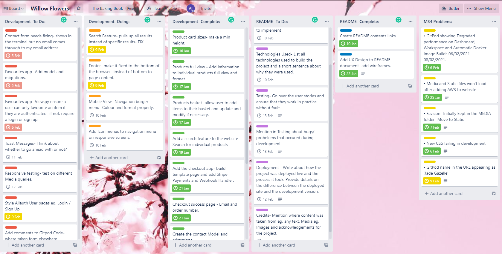

[Contents](#Contents)

# Code Structure

** Image of code structure 

[Contents](#Contents)

# Features

## Existing Features 
*	Logo – The logo appears consistently on every page in the top left corner. Once clicked, this will also direct the user back to the Home page of the website. 

*	Favicon -  The Favicon displays in the user’s browser. Should the user move to another tab, they can recognise from the favicon the Willow Flowers branding and direct back to the browser. 

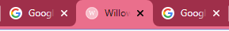

*	Icon Navigation – The top right corner of the website provides icon navigation links to Favourites, User Login, Basket and Search. These are visually accessible on every page allowing the user to quickly navigate to the required page.  

** IMAGE

*	Navigation Menu – The main navigation menu provides links to the Home page, a dropdown to the Flower products and Plant products, and a link to the Contact form. On a mobile view, these can be accessed via the responsive navigation bar. 

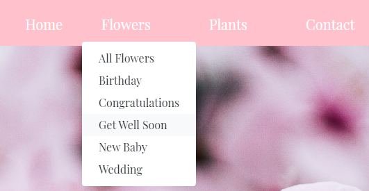

*	Contact Form – Allows users to contact Willow Flowers directly by having them fill out a contact form which requires their name, email address and a message to submit.  

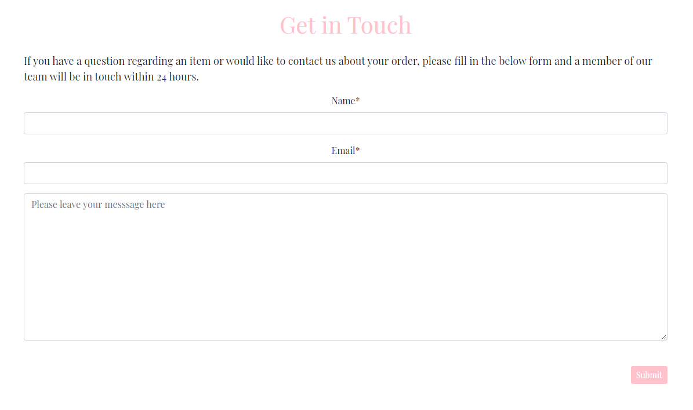

*	Customer Testimonials  - These can be found at the bottom of the home page and are used encourage new consumers to purchase products from the site based on previous customer experiences. 

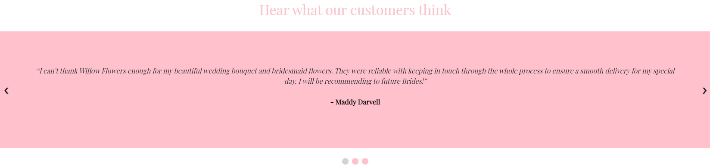

*	X3 Image links – On the home page is three circle images which provide links to the categories Birthday, Inside Plants and Wedding. When an image is clicked the user will be taken to that products category of items displayed as product cards. 

*	Product Cards – While browsing product categories, users will be presented with product cards. These will provide brief information on an items name, image, and price with a button to “view more” which will take the user to that product’s full description. 

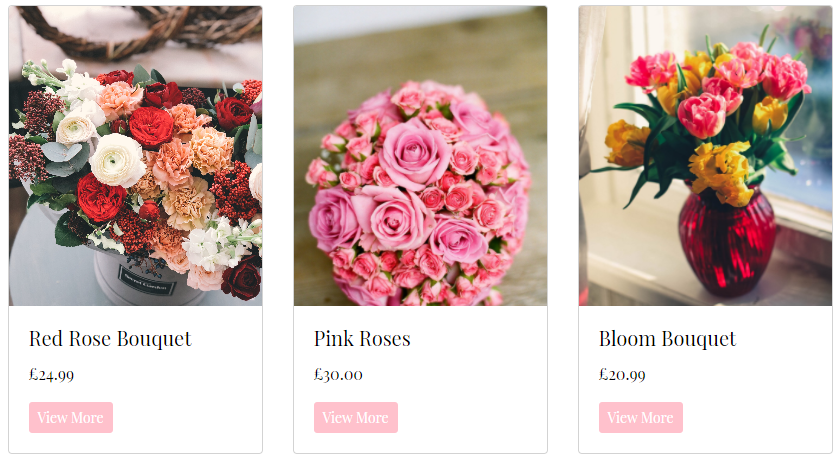

*	Search Functionality – This will be found in the navigation menu and will take a user to a page whereby they are able to enter a word based on a product they would like to find. From here a list of products resulting to that search term will be displayed.

** IMAGE

*	Links to Social Media – Links to [Pinterest](https://www.pinterest.co.uk/), [Instagram](https://www.instagram.com/) and [Twitter](https://www.instagram.com/) are accessible in the bottom right of the page footer. These links will take a user directly to the social platforms in a new browser, to ensure they don’t venture off from Willow Flowers. 

*	User Profile– Users have the option to create a personal profile whereby they can login and have access to their previous orders. The user will have to click on the user icon at the top of the page and then either login or sign up to create an account. 

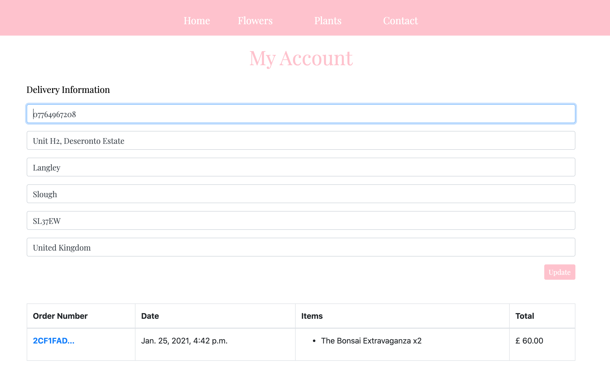

*	Add Favourite Items – The favourites features allow users to essentially save an item for later. To add a product to their favourites, a user would have to click on a products full description and select the button "Add to favourites". 

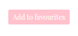

*   View Favourites - A user can access this list at anytime by clicking on the heart in the top right icon navigation. If there are no items to display in the Favourites, the user will be presented with a message “No items in your favourites” and a button leading them back to the Home page. 

** IMAGE

*	Add Items to Basket – For a user to complete a purchase on a product, they would be required to add that item to their basket. This can be completed by selecting the quantity required on the items full description and selecting “Add to basket”. 

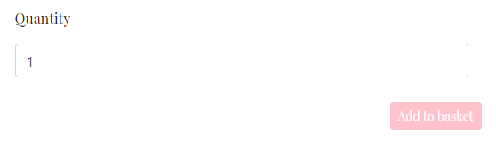

*	Update Basket - The basket icon displayed in the top right corner will take the user to a list of items currently in their basket. To add or remove quantities from their basket, the user would manipulate the quantity arrows next to each product and select “Update Basket”. 

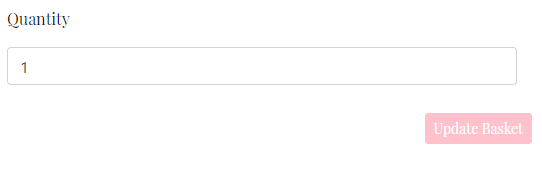

*	Checkout – To complete a purchase the user would be required to browse to their basket and click “Checkout”. They will be taken to a page whereby if they are a logged-in user, their personal information will be auto filled out. If not, the user will be required to fill in the necessary personal fields, along with their payment information. This was built using [Stripe](https://stripe.com/gb?utm_campaign=paid_brand-UK_en_Search_Brand_Stripe-2032860449&utm_medium=cpc&utm_source=google&ad_content=355351450319&utm_term=stripe%20payments&utm_matchtype=e&utm_adposition=&utm_device=c&gclid=Cj0KCQiAyJOBBhDCARIsAJG2h5fdOn7FyoK16NSYU2pwY4gixT-rSAGqwtX9Xm6m-7FI5Cl8J3Lf_90aAod7EALw_wcB) payments. 

** IMAGE

*	Checkout Confirmation – Upon completion of purchase, the user will be directed to a checkout confirmation page, informing them of the email address their confirmation has been sent to along with their order confirmation number. 

** IMAGE

*	Admin Profile – The Amin profile is created for the site superusers. The Admin view provides different access links and visuals to a standard user. By clicking on a product, they can update product information or delete the product from the website. In the Admin profile, the Admin can upload new products to the website by filling out the required information. 

** IMAGE

## Features Left to Implement

*	Live chat – Allow users to chat online with Willow Flowers to get a direct and fast response on their query.
*	About Us – Provide some information about how Willow Flowers was initially created and who are the employees involved, to give the website a more personal touch. 
*	Subscription Offer – Whereby a user can pay a monthly fee and receive a random product from Willow Flowers every month.
*	Contact Information - Provide information such as phone number, address and business hours in the far left of the Footer to display on every page. 
*	GDPR Feature- Allowing the user to opt-in to receiving promotion email offers from Willow Flowers. 
*	Review System – Give users the option to review products on a star rated system based off their personal experience with the product. These would be visible on the product cards. 
*	Toast Notifications – Previewing a brief message to users when they have complete certain actions on the website.

[Contents](#Contents)

# Technologies Used
*	[HTML5](https://developer.mozilla.org/en-US/docs/Web/Guide/HTML/HTML5) – Used as the main language for the templates.
*	[CSS3](https://www.w3.org/Style/CSS/current-work.en.html) – Used to style the website.
*	[JavaScript](https://developer.mozilla.org/en-US/docs/Web/JavaScript) – Used for some frontend functionality.
*	[Python](https://www.python.org/) – Used for backend data manipulation.
*	[Django](https://www.djangoproject.com/) – Used to enable rapid development to create a secure and maintainable website. 
*	[Bootstrap](https://getbootstrap.com/)- Used HTML	 and CSS templates to feature on the website, along with some JavaScript plugins.
*	[Pillow](https://python-pillow.org/) – Used to add images to the database.
*	[Allauth](https://django-allauth.readthedocs.io/en/latest/installation.html) – Used to create user authentication, registration, and account.
*	[Gunicon](https://docs.gunicorn.org/en/stable/configure.html) – Used to server Django Python applications through WSGI interface on production.
*	[Crispy Forms](https://django-crispy-forms.readthedocs.io/en/latest/) – Used to create forms for the website.
*	[db.sqlite3](https://sqlite.org/docs.html) – Used to hold the database while in development. 
*	[PostgreSQL](https://www.postgresql.org/docs/) – Used to store the primary data after deployment. 
*	[Git](https://git-scm.com/) – Used for version control.
*	[GitHub](https://github.com/) – Used to store my project repository.
*	[Gitpod](https://www.gitpod.io/) - Used to build the development of the website.
*	[Heroku](https://dashboard.heroku.com/) – Used to host the website.
*	[Stripe](https://stripe.com/docs) – Used to process payments on the website. 
*	[AWS](https://aws.amazon.com/) - Used for servers and storage.
    *	[S3](https://docs.aws.amazon.com/s3/index.html) – Used to store and retrieve data.
    *   [IAM](https://docs.aws.amazon.com/iam/) – Used for security.
*	[Webhooks](https://stripe.com/docs/webhooks) - Used to allow the web applications to communicate.
*	[Google Fonts](https://fonts.google.com/) – Used for website typography.
*	[Font Awesome](https://fontawesome.com/) - Used for icons.

## Other Tools 

*	[Adobe illustrator](https://helpx.adobe.com/uk/globalsearch.html?q=illustrator&start_index=0&country=GB&activeScopes=%5B%22helpx%3Alearn%22%2C%22helpx%3Ahelp%22%2C%22helpx%3Acommunities%22%2C%22adobe_com%3Aproduct%22%2C%22adobe_com%3Ablog%22%2C%22adobe_com%3Athought-leadership%22%2C%22adobe_com%3Apartner_extensions%22%2C%22adobe_com%3Aevents%22%2C%22adobe_com%3Acorporate%22%5D&scopeConfigs=%5B%7B%22value%22%3A%22helpx%3Alearn%22%2C%22renderStyle%22%3A%22horiz%22%2C%22seeMoreLink%22%3Anull%2C%22isSelectable%22%3Atrue%7D%2C%7B%22value%22%3A%22helpx%3Ahelp%22%2C%22renderStyle%22%3A%22vert%22%2C%22seeMoreLink%22%3Anull%2C%22isSelectable%22%3Atrue%7D%2C%7B%22value%22%3A%22helpx%3Acommunities%22%2C%22renderStyle%22%3A%22vert%22%2C%22seeMoreLink%22%3Anull%2C%22isSelectable%22%3Atrue%7D%2C%7B%22value%22%3A%22adobe_com%3Aproduct%22%2C%22renderStyle%22%3A%22vert%22%2C%22seeMoreLink%22%3Anull%2C%22isSelectable%22%3Atrue%7D%2C%7B%22value%22%3A%22adobe_com%3Ablog%22%2C%22renderStyle%22%3A%22vert%22%2C%22seeMoreLink%22%3Anull%2C%22isSelectable%22%3Afalse%7D%2C%7B%22value%22%3A%22adobe_com%3Athought-leadership%22%2C%22renderStyle%22%3A%22horiz%22%2C%22seeMoreLink%22%3Anull%2C%22isSelectable%22%3Afalse%7D%2C%7B%22value%22%3A%22adobe_com%3Apartner_extensions%22%2C%22renderStyle%22%3A%22horiz%22%2C%22seeMoreLink%22%3Anull%2C%22isSelectable%22%3Afalse%7D%2C%7B%22value%22%3A%22adobe_com%3Aevents%22%2C%22renderStyle%22%3A%22vert%22%2C%22seeMoreLink%22%3Anull%2C%22isSelectable%22%3Afalse%7D%2C%7B%22value%22%3A%22adobe_com%3Acorporate%22%2C%22renderStyle%22%3A%22vert%22%2C%22seeMoreLink%22%3Anull%2C%22isSelectable%22%3Afalse%7D%5D&filters=%7B%22products%22%3A%5B%5D%7D&banners=%7B%22aboveResults%22%3A%7B%22count%22%3A3%2C%22ids%22%3A%5B%22auto%22%5D%7D%2C%22sidebar%22%3A%7B%22count%22%3A0%2C%22ids%22%3A%5B%5D%7D%7D&ctrls=%7B%22prodFilts%22%3Atrue%7D) - Used to create the logo and favicon.
*	[Balsamiq](https://balsamiq.com/) – Used to create the wireframes.
*	[Grammarly](https://www.grammarly.com/p?q=brand&utm_source=google&utm_medium=cpc&utm_campaign=brand_f1&utm_content=486649398671&utm_term=grammarly&matchtype=e&placement=&network=g&gclid=Cj0KCQiAyJOBBhDCARIsAJG2h5eR5CsKtHNwTNXGyR6v2KuJYOb0_ZWW2P49aqLL15s30lS7dI7peFwaAoGyEALw_wcB&gclsrc=aw.ds) - Used to check spelling and grammar.
*	[W3C Markup](https://validator.w3.org/) - Used this to check my HTML for errors and typos.
*	[W3C CSS](https://jigsaw.w3.org/css-validator/) - Used this to check the validity of my CSS.
*	[Jshint](https://jshint.com/) – Used to check my JavaScript code.
*	[pep8online](http://pep8online.com/) – Used to validate my Python code.
*	[dbdiagram](https://dbdiagram.io/home) – Used to initially format my database schema.
*   [Slack](https://slack.com/intl/en-gb/) - Used to query code challenges.
*   [Stack overflow](https://stackoverflow.com/) - Used to query code challenges.

[Contents](#Contents)

# Testing 

## Code Validation 

## Browser Capability 

## Responsive Testing 

## User Stories 

| As a:       | I would like to:                                | So that I can:                                            |
| :---        | :----                                           |  :---                                                     |
| **User**    | Shop the florist range by occasion              | Purchase some flowers for a particular event              |
| **User**    | Create a user account                           | Keep track of my previous purchases                       |
| **User**    | Search for a particular flower                  | Order them for a specific occasion                        |
| **User**    | Add multiple products to my basket              | Order more than one item at once                          |
| **User**    | Add and delete items from my basket             | Decide on my final purchase at the end of my experience   |
| **User**    | Receive an email confirmation of my order       | Have a copy of my order number and expected delivery      |
| **User**    | Favourite an item advertised on the site        | Come back to it and purchase later.                       |
| **User**    | Contact the owners of the business              | To thank them for my purchase                             |

 

| As a:       | I would like to:                                | So that I can:                                |
| :---        | :----                                           |  :---                                         |
| **Admin**   | View a list of orders that have come through    | Process the orders                            |
| **Admin**   | Add, Update, and delete products                | Update the website when necessary             |
| **Admin**   | Receive a copy of any contact forms submitted   | So, I can respond accordingly to the customer |

## Feature Testing 

## Problems Encountered 
* Gitpod showing degraded performance on dashboard, workspace and automatic docker image builds 06/02/2021 – 08/02/2021.

* Media and Static files won’t load after adding AWS to website– After thoroughly checking the AWS Management Console and S3 Management Console, I had discovered that the code linking to the Media and Static files needed to be updated in order to link the correct URL to the images and static files.

* Favicon- Initially kept in the MEDIA folder, it would never link properly- After conducting some research I moved it to the static folder and re-coded the link I the base.html template and it then worked on every page.

* New CSS failing in development - New CSS written in mid-way through the project was failing to work in the browser- to solve the issues I had to recreate the work space by downloading my db.sqlite3 file to my PC, closing the current Gitpod workspace, clicking Gitpod on the repository in my GitHub respository, opening the new workspace, uploading the db.SQlite3 file from my PC and then reinstall the requirements.txt file to allow for Django to work. Once I had done this and ran the project all new CSS was working.

* Gitpod name in the URL appearing as ‘Jade Gazelle’ - Towards the end of my project I noticed my Gitpod URL and the Brower was showing Jade Gazelle instead of Amie Johnstone. I contacted Gitpod to query this issue and have it resolved, to which I was informed that they “have changed the workspace URLs so that it starts with something recognizable: [colour]-[animal]”.

[Contents](#Contents)

# Deployment 

The repository for this project is hosted through [GitHub Pages](https://github.com/) and is deployed live through [Heroku](https://dashboard.heroku.com/).

## Deploy code locally using the CL:

If a developer was interested in running my code locally, then they would need to follow the below steps:

1.	Login to GitHub and navigate to the main page of the repository you are wanting to clone.
2.	Above the list of files, click the green button with a downwards arrow “Code”.

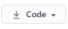

3.	To clone the repository using HTTPS, under “Clone with HTTPS”, click the clipboard icon. To clone the repository using a SHH key, including a certificate issued by your organisation’s SSH certificate authority, click “Use SSH” and then click on the clipboard icon. To clone the repository using GitHub CLI, use click “Use GitHub SLI” and then click on the clipboard to copy the URL.

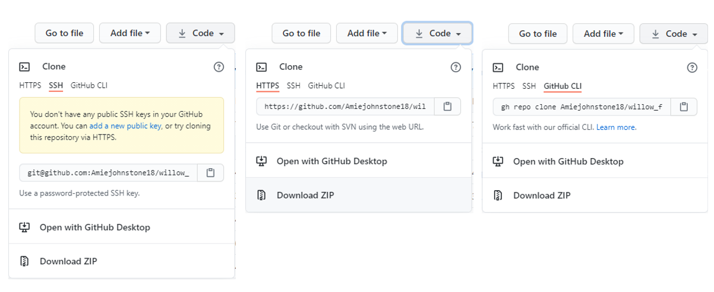

4.	Open Git Bash.
5.	Change the current working directory to the location where you want to clone the directory.
6.	Type “git clone”, and then paste the URL you copied above.
7.	Press Enter to create your local clone

### Environment Variables

You will need to set up the following environment variables on your system:

| Variable Name:        | Used For:                                                         | 
| :---                  | :----                                                             |  
| DATABASE_URL          | Deployment Only – Sets hosted Postgres database                   | 
| SECRET_KEY            | Used by Django                                                    | 
| STRIPE_PUBLIC_KEY     | Need for Stripe payments                                          | 
| STRIPE_SECRET_KEY     | Need for Stripe payments                                          | 
| STRIPE_WH_SECRET      | Need for Stripe payments                                          | 
| USE_AWS               | Deployment only – to tell Django to use S3 instead of local files | 
| AWS_ACCESS_KEY_ID     |  Need for S3 Bucket static files                                  | 
| AWS_SECRET_ACCESS_KEY | Need for S3 Bucket Static files                                   | 

Should you wish to access the URL to the website, that can be found via: [https://willow-flowers.herokuapp.com/](https://willow-flowers.herokuapp.com/)

[Contents](#Contents)

# Credits 

## Content
Customer Testimonials were written by friends Maddy Darvell, Bill Mold and Daisy Lewis.

All product descriptions were written by me. 

## Media
The flower and plant images used for this website were taken from:
*	[Pexels](https://www.pexels.com/)
*	[Pixabay](https://pixabay.com/)

## Acknowledgements
I received inspiration from this project due to the fact I have placed more orders for floral gifts in this past year then I believe ever before. 
I would like to thank Tutor support, especially Igor Basuga, for his continued help and patience during challenging times on this project. My Mentor, Aaron Sinnott for providing helpful guidance throughout and making the process as logical as he could. 

[Contents](#Contents)
