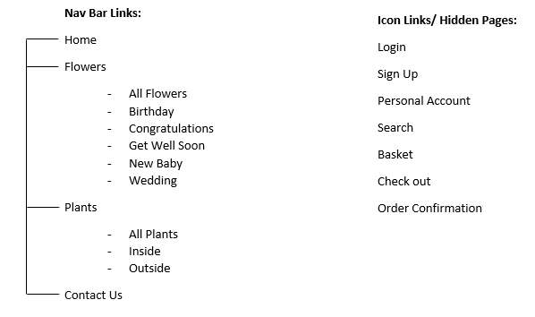
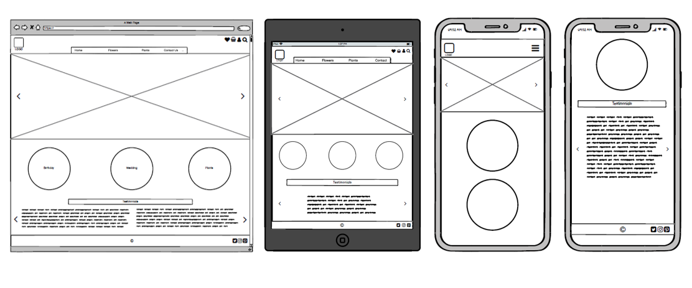

# Willow Flowers 

-> image of website on different devices 

Willow Flowers is a user-friendly e-commerce website built via main technologies [HTML](https://html.com/), [CSS](https://en.wikipedia.org/wiki/CSS), [JavaScript](https://www.javascript.com/about), [Python](https://www.python.org/) and [Django](https://www.djangoproject.com/). 
The purpose of this website is to enable consumers to purchase items such, such as plants and flowers, and create a user profile to store their previous orders and site favourites to access at any time. The site owner can upload, edit and delete products when necessary. 

# Contents
* [UX Design](#UX-Design)
    * [stratgey](##strategy)
    * [Scope](##Scope)
    * [Structure](##Structure)
    * [Skeleton](##Skeleton)
    * [Surface](##Surface)
    * [Wireframes](##Wireframes)
* [Project Development](#Project-Development)
* [Features](#Features)
* [Technologies Used](#Technologies-Used)
* [Testing](#Tesing)
* [Deployment](#Deployment)
* [Credits](#Credits)

# UX Design 

## Strategy
Following the five planes of user experience design, the strategy has been separated into *Who*, *What*, *Where*, *When* and *Why* to initially  understand the website users’ requirements and needs. 

**Who-** The customer will be an individual looking to purchase flowers or a plant for an occasion such as a Birthday, New Baby, Congratulations, Wedding, Get Well Soon and inside out outside plants. The website will therefore not have a specific target demographic. 

**What-** The idea for this website is to design and build an e-commerce florist site whereby consumers can purchase and have products from the site delivered to recipients depending on the occasion at hand. They are also able to favourite specific items and keep them in their personal account favourites to revisit later. 

**Where-** The site will promote all products available, along with links to social media platforms to showcase to a wider audience. The site will also include a contact page, whereby consumers can contact the owners with any queries they have. 

**When-** The website will be available for users to make a purchase at any point in their journey, however, it will also provide information about order cut offs for expected delivery dates and times. 

**Why-** Consumers will want to use this website to purchase florist products due to its easy navigation and information architecture layout, and simple payment process.

## Scope
The features included in this website will consist of:
* The option to narrow down a product search through filtering the occasion. 
* A search page to pull up results based on name and description (through a term such as a colour).
* Personal login to view previous orders.
* An option to sign up as a website user- to complete a purchase or save items to your favourites.
* Shopping basket to display reserved items and a subtotal amount (£).
* Testimonials from previous customers.
* Online payments and order confirmation.

## Structure 
Information architecture will be organised via product information. Bootstrap cards will be used to organise the product preview images on pages such as the search, the product pages and the basket to keep the layout clean and simple. Buttons will guide the user to complete their purchase, sign up, login or navigate to another page on the site. 

## Skeleton
The navigation menu will be divided like so:

## Surface
Due to the fact there will be a lot of bursts of colour through the imagery of the products, I thought it would be best to keep surrounding colours minimal as to not over-crowd the page and avoid distraction for users. I will use an accent colour of Bubblegum Pink (#ffc1cc)  for the navigation menu, footer and buttons. The font used will be [Playfair Display](https://fonts.google.com/specimen/Playfair+Display?query=playfair), taken from [Google Fonts](https://fonts.google.com/).

## Wireframes 
Below is a preview of the Home Page wireframes for desktop, tablet and mobile created on [Balsamiq](https://balsamiq.com/). The individual desktop, tablet and mobile wireframes with all pages can be found [here](README-wireframes).

# Project Development 

# Features

# Technologies Used
* [HTML](https://html.com/)
* [CSS](https://en.wikipedia.org/wiki/CSS)
* [JavaScript](https://www.javascript.com/about)
* [Python](https://www.python.org/) 
* [Django](https://www.djangoproject.com/)
* [Bootstrap](https://getbootstrap.com/)
* [Pillow](https://pillow.readthedocs.io/en/stable/)
* [Allauth](https://django-allauth.readthedocs.io/en/latest/installation.html)
* [Google Fonts](https://fonts.google.com/)
* [Font Awesome](https://fontawesome.com/)

# Testing 

# Deployment 

# Credits 